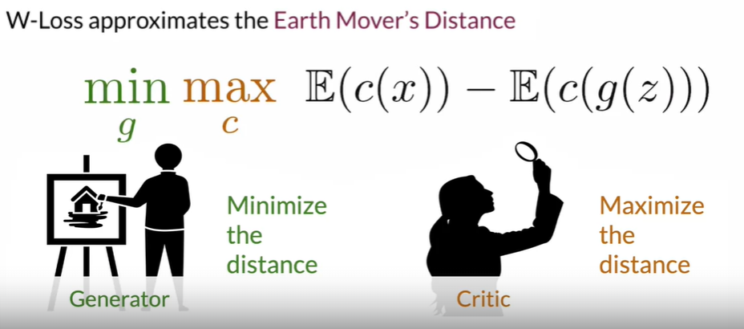
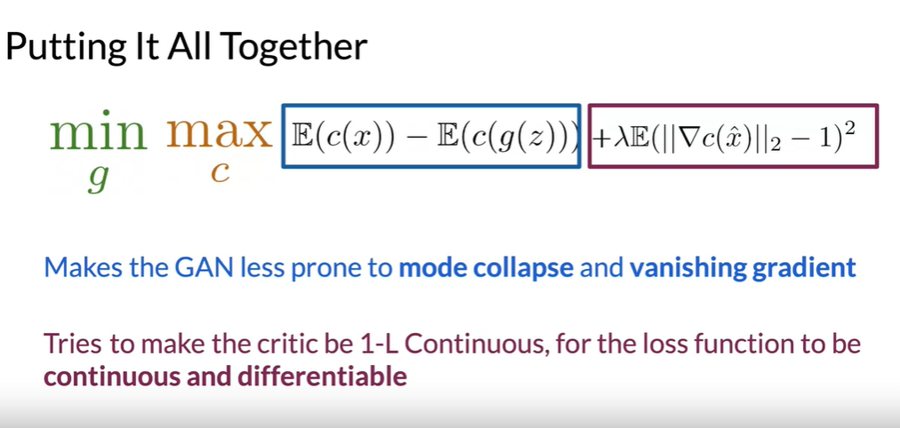

## Wassersteing GAN

> Also called WGAN. It is a **upgrated version of GAN** that introduces another cost function and minimizes the Earth-Mover's distance (EM).

**Resources for this topic**

- [Towards Data Science](https://jonathan-hui.medium.com/gan-wasserstein-gan-wgan-gp-6a1a2aa1b490)

### WGAN - Pros and Cons

  <table style="display: inline-block;">
    <tr style="background-color: lightgray;">
      <th>Pros</th>
      <th>Cons</th>
    </tr>
    <tr>
      <td>Better stability</td>
      <td>Longer training</td>
    </tr>
    <tr>
      <td>Meaningful loss (which is correlated with convergence and quality of samples)</td>
      <td>???</td>
    </tr>
    <tr>
        <td>Improved stability</td>
        <td>???</td>
    </tr>
  </table>

> [Read-through: Wasserstein GAN](https://www.alexirpan.com/2017/02/22/wasserstein-gan.html) article by Alexander Irpan in order to better understand the math behind WGAN.

- Mode Collapse - when the model collapses and generates images of only one class or only specific classes.

- Wasserstein Loss - approximates the Earth Mover's Distance
  

      
  

    </body>

- Critic - it tries to maximize the distance between the real distribution and the fake distribution.
- intermediate image -

#### BCE Loss vs Wasserstein Loss

| BCE Loss                                                                                                     | Wasserstein Loss                                                                                    |
| ------------------------------------------------------------------------------------------------------------ | --------------------------------------------------------------------------------------------------- |
| **Discriminator** outputs values between **0 and 1** (classifies fake and real as 0 and 1)                   | **Critic** outputs **any number** (scores images with real numbers). It is **not bounded!**         |
| $-[\mathbb{E}\log{(d(x))} + \mathbb{E}(1 - \log{(d(g(z)))})]$                                                | $\mathbb{E}(c(x)) - \mathbb{E}(c(g(z)))$                                                            |
|                                                                                                              | Helps with mode collapse and vanishing gradient problem.                                            |
| Measures how bad, on average, some observations are being classified by the discriminator, as fake and real. | Approximates the **Earth Mover's Distance**.                                                        |
| There is **no special condition**.                                                                           | **Condition:** function needs to be 1-L Continuous $\|\nabla \text{critic}(\text{image})\|_2 \le 1$ |

#### Weight clipping

#### Gradient penalty

Calculating the gradient penalty can be broken into two functions: (1) compute the gradient with respect to the images and (2) compute the gradient penalty given the gradient.

$$(\|\nabla c(\hat{x}) \|_2 - 1)^2$$
$\hat{x} = \epsilon x + ( 1 - \epsilon) g(z) $
$\hat{x}$ - mixed image.
$x$ - real image.
$g(z)$ - generated (fake) image.
$\epsilon$ - ??? Small number?
$c(\hat{x})$ - critics score on the mixed image.

