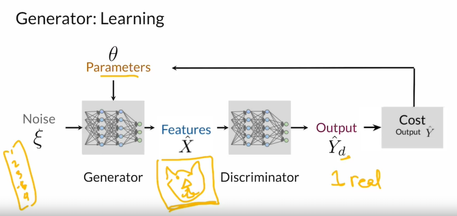

# Theory Notes 01

Notes based on [Coursera Course](https://www.coursera.org/learn/build-basic-generative-adversarial-networks-gans) _Build Basic Generative Adversarial Networks_. The notes aim to cover the topics from the course and add some information and recourses around covered topics.

## 1. Introduction

### 1.0. Covered topics

- Introduction do GANs (Generator, Discriminator).
- BCE Loss
- Challanges / Problems with GANs (and how to avoid them)
- Deep Convolution GAN
- Wasserstein GAN Gradient Penalty

### 1.1. Discriminator

> A Generative Adversial Network consists of two models. A **discriminator** and a **generator** which compeat with each other.

- **Task:** Grade the generator by evaluating the generated image as fake or real.
- **Input:** Image (generated or real) / Input features X.
- **Output:** Probability of class y (number between 0 and 1).

#### Discriminator - details

### 1.2. Generator

#### generator-in-a-nutshell

- **Task:** Generate fake images that will look like real ones.
- **Input:** Random noise (random features).
- **Output:** Generated image.

#### Other...

### 1.3. BCE Cost Function

- Measure of how far away from the actual label (0 or 1) is the prediction.
- **Close to zero** when the label and the prediciton are **similar** (perfect model would have 0 loss). Approaches **infinity** when the label and the prediciton are **different.**
- Output range: between 0 and 1
- Used when we want to classify things into two classes (here real and fake images).
- For example if the real label is 0 a prediciton 0.98 would be bad and the loss would get high.
- Log loss penalizes wrong predictions as well as confident and wrong predicitons.

Formula:
$$BCE = -\frac{1}{n}\sum_{i=1}^n[ (y_i \log{(p(\hat{y_i}))} + (1 - y_i)\log{(1- p( \hat{y_i}))}]$$
$$BCE = -\frac{1}{n}\sum_{i=1}^n[ (y_i \log{(\hat{y_i})} + (1 - y_i)\log{(1- \hat{y_i})}]$$

- $y$ - ground truth label (0 or 1).
- $\hat{y}$ - predicted label (between 0 and 1).
- $n$ - number of samples.

#### Binary Cross Entropy calculation example

| i-th sample | Ground truth label $y$ | Predicted label $\hat{y}$ |
| ----------- | ---------------------- | ------------------------- |
| 1           | 1                      | 0.9                       |
| 2           | 1                      | 0.1                       |
| 3           | 0                      | 0.3                       |

$BCE = - \frac{(1 \cdot \log{0.9} + (1 - 1)\cdot \log{(1- 0.9)} ) + (1 \cdot \log{0.1} + (1 - 1)\cdot \log{(1- 0.1)} ) + (0 \cdot \log{0.3} + (1 - 0)\cdot \log{(1 - 0.3)} )}{3} ≈ -\frac{\log{(0.9)} + \log{(0.1)} + \log{(0.7)}}{3} ≈ - \frac{-0.105 -2.303 -0.357}{3} = 0.56$

Coursera formula:

$$J(\theta) = -\frac{1}{m}\sum_{i=1}^{m}[y^{(i)}\log{(h(x^{(i)}, \theta))} + (1 - y^{(i)})\log{(1 - h(x^{(i)}, \theta))}]$$

- $\theta$ - parameters of the generator.
- $y^{(i)}logh(x^{(i)}, \theta)$ - used to calculate the loss when $y^{(i)} = 1$.
- $(1 - y^{(i)})log(1 - h(x^{(i)}, \theta))$ - used to calculate the loss when $y^{(i)} = 0$.

| $y^{(i)}$ | $h(x^{(i)}, \theta)$ | $y^{(i)} h(x^{(i)}, \theta)$ | Relevant term                 |
| --------- | -------------------- | ---------------------------- | ----------------------------- |
| $0$       | any                  | $0$                          | $log(1 - h(x^{(i)}, \theta))$ |
| $1$       | $0.999$              | $~0$                         | $log(h(x^{(i)}, \theta))$     |
| $1$       | $~0$                 | $-\infty$                    | $log(h(x^{(i)}, \theta))$     |

### Resources to this topic

- [Hands-on Machine Learning with Scikit-Learn, Keras, and TensorFlow](https://www.oreilly.com/library/view/hands-on-machine-learning/9781492032632/) chapter 4 (logistic regression)

## 1.4. GAN Challenges | Herausforderungen

#### Confusing loss function values :confused:

Intuitive the lower is the generators cost function the better should be the generated image. In reality it is not so straight forward. The gerator is graded by the discriminator which improves over time and detects even verry realistic fake images. Sometimes **despite improvment in qualitu of generated images the generators loss function is growing.**

#### Hyperparameters

There are a lot of hyperparameters in GAN networks. Moreover, GANs are **extremly sensitive** to changes of them. Thats why hyperparameter tuning becomes a challenging task.

#### Mode collapse (pol. załamanie trybu)

It occurs when the generator finds a **small number of samples** (instead of exploring the whole training data) that succesfuly **fool the discriminator.** In result the generator becomes stuck in a particular pattern, failing to generate diverse images.

#### Overcoming challenges :sunglasses:

In order to overcome described problems a WGAN or WGAN-GP (Wasserstein GAN Gradient Penalty) archtecture should be consideres.

## 1.5. DCGAN (Deep Convolutional GAN)

### Architecture guidelines for stable Deep Convolutional GANs (cited from [DCGAN paper](https://arxiv.org/abs/1511.06434) )

• Replace any pooling layers with strided convolutions (discriminator) and fractional-strided
convolutions (generator).
• Use batchnorm in both the generator and the discriminator.
• Remove fully connected hidden layers for deeper architectures.
• Use ReLU activation in generator for all layers except for the output, which uses Tanh.
• Use LeakyReLU activation in the discriminator for all layers.

### WGAN - Pros and Cons

  <table style="display: inline-block;">
    <tr style="background-color: lightgray;">
      <th>Pros</th>
      <th>Cons</th>
    </tr>
    <tr>
      <td>Better stability</td>
      <td>Longer training</td>
    </tr>
    <tr>
      <td>Meaningful loss (which is correlated with convergence and quality of samples)</td>
      <td>???</td>
    </tr>
    <tr>
        <td>Improved stability</td>
        <td>???</td>
    </tr>
  </table>

- Mode Collapse - when the model collapses and generates images of only one class or only specific classes. It happents due to the fact that the generator some times manages to fool the discriminator with images of a particular class and decided to generate images only belonging to that class.

- Wasserstein Loss - approximates the Earth Mover's Distance. Used to solve the **mode collapse** issue.

- Critic - it tries to maximize the distance between the real distribution and the fake distribution. A new name for a discriminator.

### BCE Loss vs Wasserstein Loss

| BCE Loss                                                                                                                                                          | Wasserstein Loss                                                                                                                            |
| ----------------------------------------------------------------------------------------------------------------------------------------------------------------- | ------------------------------------------------------------------------------------------------------------------------------------------- |
| **Discriminator** outputs values between **0 and 1** (classifies fake and real as 0 and 1). This is because of the sigmoid activation function in the last layer. | **Critic** outputs **any number** (scores images with real numbers). It is **not bounded!** There is no sigmoid function in the last layer. |
| $-[\mathbb{E}\log{(d(x))} + \mathbb{E}(1 - \log{(d(g(z)))})]$                                                                                                     | $\underset{g}{\min} \: \underset{c}{\max} \: \mathbb{E}(c(x)) - \mathbb{E}(c(g(z)))$                                                        |
|                                                                                                                                                                   | Helps with mode collapse and vanishing gradient problem.                                                                                    |
| Measures how bad, on average, some observations are being classified by the discriminator, as fake and real.                                                      | Approximates the **Earth Mover's Distance**.                                                                                                |
| There is **no special condition**.                                                                                                                                | **Condition:** function needs to be 1-L Continuous $$\|\nabla \text{critic}(\text{image})\|_2 \le 1$$                                       |
| Uses $0$ and $1$ as labels.                                                                                                                                       | Uses $1$ and $-1$ as labels.                                                                                                                |

### Lipschitz continuity :small_red_triangle:

> :bulb: It is a **neccesery restriction for the critic** used in WGAN. The critic have to be a [continuous](https://en.wikipedia.org/wiki/Continuous_function) [function 1-Lipschtiz](https://en.wikipedia.org/wiki/Lipschitz_continuity).

Critic is a function which transforms an image into a prediction.

Critic is a 1-Lipschtiz function if for any two images $x_1$ and $x_2$:
$$\frac{|C(x_1) - C(x_2)|}{|x_1 - x_2|} \le 1$$
In this formula $|C(x_1) - C(x_2)|$ is the absolute difference between the critics predictions and $x_1 - x_2$ is the difference between pixel values.

> :bulb: In other words we **restrict the speed** of the changes in critics predictions.

### Weight clipping :scissors:

### Gradient penalty :tired_face:

Calculating the Gradient Penalty can be splitted into two steps:

1. Compute the gradient with respect to the images.
2. Compute the gradient penalty given the gradient.

The Gradient Penalty can be described as:
$$\underset{g}{min} \, \underset{c}{max} \, \mathbb{E}(c(x)) - \mathbb{E}(c(g(z)) + \lambda \mathbb{E}(||\nabla c(\hat{x})||_2 - 1) ^ 2$$

**Models:**

- $g$ - Generator. More about generator in this script can be found [here.](generator-in-a-nutshell)
- $c$ - Critic.

**Vectors / Marces:**

- $x$ - real image.
- $z$ - noise vector.
- $g(z)$ - generated (fake) image.
- $\hat{x} = \epsilon x + ( 1 - \epsilon) g(z) $ - Mixed image. In other words the mixed image is created by weighting the real and fake image with $\epsilon$ (epsilon) and then adding those images.
- $c(\hat{x})$ - critics score on the mixed image.

**Other:**

- $\mathbb{E}$ - The Expected Value, denoted as E(X) or is a measure of the central tendency of a random variable.
- $\mathbb{E}(c(x))$ - Expected Value of the critic's prediction when it receives real images $x$ as input. In other words, it is the **average output of the discriminator when it evaluates real data.**
- $\mathbb{E}(c(g(z)))$ - Expected Value of the critic's prediction when it receives generated images $g(z)$ as input. In other words, it is the **average output of the discriminator when it evaluates the generated (fake) data** produced by the generator.
- $\underset{g}{min}$ - Generator tries to minimize the difference between the expected values. In other words, it tries to produce as realistic images as possible making them look like more simmilar (reducing the distance) to the real examples.
- $\underset{c}{max}$ - Critic tries to maximize the difference between distributions.
- $\lambda \mathbb{E} \left( \left\| \nabla c(\hat{x}) \right\|_2 - 1 \right)^2$ - Gradient Penalty (improves the training stability).
- $\lambda$ - Gradient weighting factor.
- L2 Norm (Magnitude).

### Resources

- [Read-through: Wasserstein GAN](https://www.alexirpan.com/2017/02/22/wasserstein-gan.html) article by Alexander Irpan in order to better understand the math behind WGAN.
- [What is Norm in Machine Learning?](https://www.youtube.com/watch?v=FiSy6zWDfiA) by Normalized Nerd on YouTube.
- Expected Value Wikipedia [Polish](https://pl.wikipedia.org/wiki/Warto%C5%9B%C4%87_oczekiwana) and [English](https://en.wikipedia.org/wiki/Expected_value).

# Conditional GAN & Controllable Generation

> Conditional GANs can generate images of a **desired class** or an image with **desired feature.**
> ⚠️ Conditional GANs **require a labeled dateset!**

### Conditional vs. Unconditional Generation

| Conditional                            | Unconditional                                  |
| -------------------------------------- | ---------------------------------------------- |
| Examples from the classes you want.    | Examples from random classes.                  |
| Training dataset have to be annotated. | Training dataset dosen't need to be annotated. |

### ➡️ Generator Input

| Component        | Description                                                                                                                                         | Carried Task                                   |
| ---------------- | --------------------------------------------------------------------------------------------------------------------------------------------------- | ---------------------------------------------- |
| Noise Vector $z$ | One dimensional vector of random numbers.                                                                                                           | Providing randomness in the generation proces. |
| Class Vector     | One-hot encoded vector telling the model instance from which class should be generated. Size of the class vector is equal to the number of classes. | Controlling the generation process.            |
| Combined vector  | Noise vector + Class vector                                                                                                                         |                                                |

### ➡️ Discriminator Input

> The classes are passed to the discriminator as on-hot matrices.

### Controllable Generation vs. Conditional Generation

| Compared Feature | Controllable                                                                 | Conditional                             |
| ---------------- | ---------------------------------------------------------------------------- | --------------------------------------- |
| Examples         | Examples with the **features** you desire.                                   | Examples of the **classes** you desire. |
| Training dataset | Training dataset dosen't need to be annotated.                               | Training dataset have to be annotated.  |
|                  | Manipulate the $z$ vector input.                                             | Append a class vector to the input.     |
| Challanges       | When trying to control one feature, others that are correlated might change. |                                         |

> ⚠️ It is not possible to control **single** output features. Some features are usually corelated witch each other. For example when generating people faces a `beard` feature will be correlated with a `male-sex` feature.

### Transpose Convolution `torch.nn.ConvTranspose2d`

> 🤷‍♂️ The name can be confussig. There is no transpose or real convolution used.
> A good explanation of this by [Shubham Singh](https://www.youtube.com/watch?v=U3C8l6w-wn0) on YouTube.

- Transpose convolution means to scalar-multiply a kernel by each pixel in an image.
- The dimensions of the result tensor of transpose convolution is greater than the source dimensions.
- It is used to upscale images.
- Takes the same parameters as standard convolution: `kernel_size`, `padding` and `stride`.

$$N = s(M - 1) + f - 2p$$
Where:

- $N$ - Number of pixels in output image.
- $M$ - Number of pixels in input image.
- $s$ - Stride (skipping parameter).
- $p$ - Padding.
- $f$ - Kernel (Filter) size.

<b>Visual Example of Transpose Convolution</b>

# Glossary

- Earth Mover's Distance - its a measure of **how different two distributions are** by estimating the effort it takes to make the generated distribution equal to the real one.
- Vanishing Gradient Problem -

# Resources

### You Tube

- [Practical GAN YouTube tutorials](https://www.youtube.com/watch?v=OXWvrRLzEaU&list=PLhhyoLH6IjfwIp8bZnzX8QR30TRcHO8Va) by
  Aladdin Perss
- [WGAN implementation from scratch (with gradient penalty)](https://www.youtube.com/watch?v=pG0QZ7OddX4)
- Understand [Transpose convolution](https://www.youtube.com/watch?v=U3C8l6w-wn0) by Shubham Singh - theory explanation and Python implementation.

### Papers

- Interactive paper [Deconvolution and Checkerboard Artifacts](https://distill.pub/2016/deconv-checkerboard/)
- [Unsupervised Representation Learning with Deep Convolutional Generative Adversarial Networks](https://arxiv.org/abs/1511.06434)
