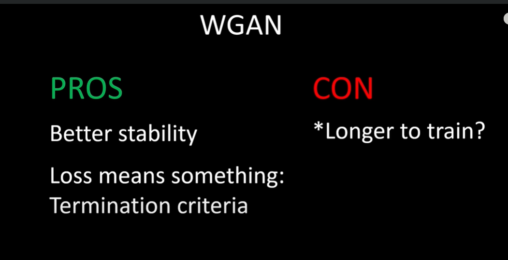
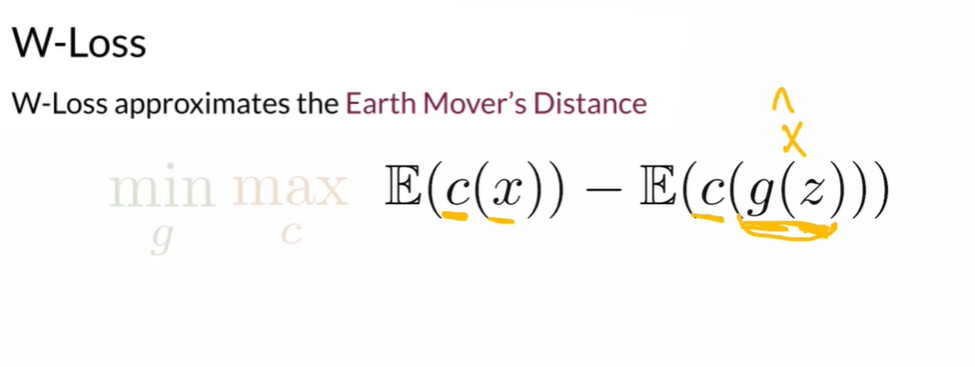

# Course 2 - Better undersdanding of GANs

## 1. Inception-v3 Architecture

> 🏃 Commonly used as a feature extractor. It is a huge classifier model trained on ImageNet. Thanks to it we can extract meaningful features and compare images with them.

<!-- TODO: Why do we even talk about this? -->

> **Fun fact from Wikipedia:** [The original name (Inception)](https://en.wikipedia.org/wiki/Inceptionv3) was codenamed this way after a popular "'we need to go deeper' internet meme" went viral, quoting a phrase from the Inception film of Christopher Nolan.
>
> 

<!-- | Big Kernel Size | Small Kernel Size               | When desired? |
| --------------- | ------------------------------- | ------------- |
|                 | Information distributed locally |               | -->

> To use Inception Architecture as a **feature extractor we cut off the classification layer**. In `pytorch` this can be done with the following code:
>
> #### `inception_model.fc = torch.nn.Identity()`
>
> Where `fc` represents the last fully connected layer (classification layer that outputs propabilities per class) and [`nn.Identity`](https://pytorch.org/docs/stable/generated/torch.nn.Identity.html) is a placeholder that returns the input data without any changes.

### Resources related to this topic

- [Papers with code](https://paperswithcode.com/method/inception-v3)
- Towards Data Science ["A Simple Guide to the Versions of the Inception Network"](https://towardsdatascience.com/a-simple-guide-to-the-versions-of-the-inception-network-7fc52b863202) by Bharath Raj. It explains what Inception Model familly is, what problem it solved and goes trought the 3 versions.

## 2. Fréchet Inception Distance (FID)

> 🏃 FID measures the **distance between two distributions**. The lower the better.
> 🧠 Quantifies the difference between the distributions of **features extracted** from real and generated images using an **Inception-v3** neural network.
> ✅ **Lower** FID means that the generated images are more **realistic.**
> ❌ **High** FID means a **lack of diversity or fidelity.**
> ⏳ Introduced in 2017 and has generally **superseded inception score** as the preferred measure of generative image model performance.
> ⛓️ There is **no strict range** for FID. But usually the closer to zero the better.
> 🐘 Use a **large sample** size to **reduce noise.**

  

### Fréchet Distance Between Normal Distributions

### $$d(X,Y) = (\mu_X-\mu_Y)^2 + (\sigma_X-\sigma_Y)^2 $$

- $\mu_X$ - mean of distribution $X$.
- $\sigma_X$ - standard deviation of distribution $X$.

### Covariance

> 🏃 Its a measure of variance of 2 variables.

Value at location $(i, j)$ in the correlation matrix corresponds to the covariance of vector $i$ with vector $j$. Covariance of $i$ with $j$ and $j$ with $i$ is equivalent, so the correlation matrix will always be symmetric with respect to its diagonal (On the diagonal there is the covariance of that element with itself).

Higher variance = bigger area of the circle

| Number of variables | Name              |
| ------------------- | ----------------- |
| One                 | Variance          |
| Two                 | **Co**variance    |
| More                | Covariance Matrix |

- If **zeros are everywhere except the diagonal** it means the dimensionc are **intependent**.
- If values **other than zeros** are on the **diagonal** it means the dimensions **covary**.

### Multivariate Normal Fréchet Distance

> 🏃 Real and fake embeddings are two multivariate normal distributions. Using FID we can calculate the distance between these distributions.

##### Formula for Univariate Normal Fréchet Distance

$$(\mu x - \mu y)^2 + (\sigma x - \sigma y)^2$$

##### Formula for Multivariate Normal Fréchet Distance

### $$\lVert \mu x - \mu y  \rVert ^ 2 + Tr(\Sigma x + \Sigma y - 2 \sqrt{\Sigma x \Sigma y})$$

$\lVert \mu x - \mu y  \rVert ^2 $ - Magnitude of the vector.
$Tr$ - trace of a matrix (sum of its diagonal elements of a matrix).
$\Sigma$ - Covariance.
$\mu x$ - mean of the real embeddings.
$\mu y$ - mean of the fake embeddings.
$\Sigma x$ - Covariance matrix of the real embeddings.
$\Sigma y$ - Covariance matrix of the fake embeddings.

### Problems with FID

- Not all features are captured by the pre-trained inception model (ImageNet represents not everything in the universe).
- Not fast.
- Mean and covariance (first two moments of a distribution) don't cover all aspects of a distribution.
- A large dataset (smaple size) is needed to work properly.

> **How does FID measure the difference between reals and fakes?**
> By considering the real and fake embeddings as two distributions and comparing the statistics of between those distributions.

### Resources related to Covariance & FID

- [Kaggle Notebook about FID](https://www.kaggle.com/code/ibtesama/gan-in-pytorch-with-fid)
- [Target Tech What is the Fréchet inception distance (FID)?](https://www.techtarget.com/searchenterpriseai/definition/Frechet-inception-distance-FID) - Overview of FID, comparision with Inception Score.
- [Covariance explanation on YouTube](https://www.youtube.com/watch?v=TPcAnExkWwQ) by Normalized Nerd.
- [Covariance explanation on YouTube](https://www.youtube.com/watch?v=qtaqvPAeEJY) by StatQuest.
- [Covariance and Correleation](https://ai-ml-analytics.com/covariance-and-correlation/) explanation by ai-ml-analytics.com

## 3. KL Divergence (Relative Entropy)

> 🏃 Measures **difference in information** represented by two distributions.
> ♻️ Combines high and low entropy into one metric

### Math

### $$DL(p(y|x) || p(y)) = p(y|x) \log{\left(\frac{p(y|x)}{p(y)}\right)}$$

Measures **how much information** you can get or gain on $p$ of $y$ for a particular $x$, given just $p$ of $y$.

- **$p(y|x)$** - (generated data distribution) conditional distribution of generated data $y$ given some latent input $x$. In GANs, the generator network takes random noise or latent vectors as input $x$ and generates data $y$, such as images. $p(y|x)$ indicates **how well the generator is able to capture the data distribution conditioned on the latent input.**
- **$p(y)$** - (real data distribution) **marginal distribution of real data $y$.** In GANs, this distribution corresponds to the distribution of real data that we want the generator to approximate. Ideally, the **generator should generate data that is similar to this distribution.**
- **$DL(p(y|x) || p(y))$** - KL Divergence between $p(y|x)$ and $p(y)$. It quantifies the difference between the distribution of generated data and the distribution of real data. In the context of GANs, minimizing this divergence is a key objective. When the generator is trained to minimize this divergence, it aims to generate data that is as close as possible to the distribution of real data.
- **$p(y|x) \log{\left( \frac{p(y|x)}{p(y)} \right)}$** - This term within the equation measures **how much information is lost when using the distribution p(y) to approximate p(y|x).** The logarithm term captures the ratio of these two distributions. When this ratio is close to 1, it indicates that the generator is generating data that matches the real data distribution well.

  

- In summary, the equation for KL Divergence in the context of GANs **quantifies how well the generated data distribution $p(y|x)$ matches the distribution of real data $p(y)$.**

> ### Outside of GANs context
>
> ### $$KL(P || Q) = \sum_x P(x) \log{\left(\frac{P(x)}{Q(x)}\right)}$$
>
> - ,,Relative to Q how much P is different (has changed)".
> - $P$ - Current distribution
> - $Q$ - Refrence distribution
>   The multiplication by $P(x)$ weights the importance of change of a variable.

> 🤷‍♂️ **Why KL Divergence is not called KL Distance?**
> In the opposite direction, the KL divergence is not the same in both directions. However, the distances are always the same regardless of direction.

### 🤯 KL-Divergence vs. FID vs. Inception Score

| Feature             | KL Divergence                                         | FID (Fréchet Inception Distance)                                              | Inception Score                                  |
| ------------------- | ----------------------------------------------------- | ----------------------------------------------------------------------------- | ------------------------------------------------ |
| Purpose             | Measures difference between probability distributions | Evaluates image quality in generative models (does not measure the diversity) | Measures image quality and diversity in GANs     |
| Symmetry            | Asymmetric: D(A \| B) ≠ D(B \| A)                     | Symmetric: FID(A, B) = FID(B, A)                                              | Not applicable to Inception Score                |
| Domain              | General: Applicable to various distributions          | Image Generation: Specifically for image quality                              | Image Generation: Specifically for image quality |
| Information Measure | Measures information/content difference               | Measures **feature space distance** between images                            | Measures **quality and diversity** of GAN images |
| High-Dimensional    | May have challenges in high-dimensional spaces        | Designed for high-dimensional image spaces                                    | Designed for high-dimensional image spaces       |
| Application         | General-purpose: Widely used in statistics, ML        | GAN Evaluation: Commonly used for GANs                                        | GAN Evaluation: Specifically for image diversity |
| ✅ Desired value    | The **lower** the better.                             | **Lower** FID means that the generated images are more **realistic.**         | The **higher** the IS the better.                |

### Resources related to KL Divergence

- You Tube explanation [of divergence](https://www.youtube.com/watch?v=q0AkK8aYbLY) by ritvikmath - Slow explanation on paper of KL Divergence concept (outside the GAN context). Example of use in datascience.
- [Understanding KL Divergence](https://towardsdatascience.com/understanding-kl-divergence-f3ddc8dff254) by Aparna Dhinakaran.

## 4. Inception Score

> 🏃 Measures the quality and diversity of generated images. The higher the IS the better.
> ⏳ FID has generally **superseded inception score**, however **Inception Score** was widely cited in papers.
> ♻️ Uses **inception-v3** model (but **not** as a feature extractor like FID).
> Low Entropy = Better Fidelity
> High Entropy = Better Diversity

### Inception Model Classification

$p(y | x)$ - measures the distribution $p$ of $y$ given $x$ where given your image $x$, what is the distribution over those classes given that classifier?
$P(y)$ - The **marginal label distribution** or $p$ of $y$. It's a distribution over all labels across your entire dataset or across a large sample

$$IS  = exp(\mathbb{E}_{x \sim pg} D_{KL}(p(y | x ) || p(y)))$$

- $D_{KL}(p(y | x ) || p(y)))$ - KL Divergence.
- $\mathbb{E}_{x \sim pg}$ - sum and average of all results.
- $p(y|x)$ - conditional probability distribution.
- $p(y)$ - marginal probability distribution.

|           | Lowest possible value | Highest (best) possible value                                                                                               |
| --------- | --------------------- | --------------------------------------------------------------------------------------------------------------------------- |
| Math      | $$0$$                 | $$\infty$$                                                                                                                  |
| Real Life | $$1$$                 | **Number of classes** (in the case of Inception-v3 it is 1000, beacause it was trained on ImageNet which has 1000 classes). |

- More about Inception Score in this [paper ,,A Note on the Inception Score"](https://arxiv.org/abs/1801.01973) by Shane Barratt, Rishi Sharma.
- Explanation of [Inception Score](https://www.techtarget.com/searchenterpriseai/definition/inception-score-IS) by Stephen J. Bigelow. It also esplains in a nice way **what a probablility distribution is**.

> **Determining the final inception score.**
>
> 1. Process generated images through discriminator to obtain the conditional probability distribution or $p(y|x)$.
> 2. Calculate the marginal probability distribution or $p(y)$.
> 3. Calculate the KL divergence (between $p(y)$ and $p(y|x)$).
> 4. Calculate the sum for classes and calculate an average score for all images (basically repeat the previous steps for all images in the computer-generated set or sample).
> 5. Calculate the average value of all results $\mathbb{E}_{x \sim pg}$ and take its exponent (exp).
>
> This final result is the inception score for the given set of generated (fake) images.

### Problems with Inceprion Score

- Do not cover all useful features (ImageNet is not a representative dataset for every case).
- Can be exploited or gamed. Generate only one realistic image of each class.
- No comparison to real images (makes it only looks at fake images).
- Works with small square images (about 300 x 300 pixels).
- It can give a false idea of the performance if the generator generates only one image per class.

### Inception Score vs. Fréchet Inception Distance

| Feature | IS                                 | FID                                    |
| ------- | ---------------------------------- | -------------------------------------- |
| Data    | Evaluates **only on fake** images. | Evaluates on **real and fake** images. |

### Resources

- [GAN — How to measure GAN performance? (Hui, 2018)](https://medium.com/@jonathan_hui/gan-how-to-measure-gan-performance-64b988c47732)

## 5. Sampling and Truncation

### Truncation Trick

> **How does truncation trick sampling work, and when do you use it?**
> By sampling at test time from a normal distribution with its tails clipped.

> Notebook C2W3
> 

https://paperswithcode.com/method/truncation-trick

### HYPE

- Intrigued about human evaluation and HYPE (Human eYe Perceptual Evaluation) [paper](https://arxiv.org/abs/1904.01121)

## 6. Precision & Recall (in context of GANs)

- paper [Assessing Generative Models via Precision and Recall](https://proceedings.neurips.cc/paper_files/paper/2018/file/f7696a9b362ac5a51c3dc8f098b73923-Paper.pdf)
  https://jonathan-hui.medium.com/gan-how-to-measure-gan-performance-64b988c47732

What is recall related to in the context of GANs evaluation, and what is it a measure of?Recall is related to diversity and measures of how well the generator models all the variation in the reals. Recall measures the intersection over all the reals.Recall is how much overlap there is over all the reals. It is related to diversity because you can see if the generator models all the variation in the reals or not.

- [Improved Precision and Recall Metric for Assessing Generative Models (Kynkäänniemi, Karras, Laine, Lehtinen, and Aila, 2019)](https://arxiv.org/abs/1904.06991)

## Disadvantages of GANs

- Unstable training (Mode Collapse). Now it is sovled thanks to Wasserstein GANs.
- Lack of intristic evaluation metric.
- No density estimation.
- Incerting is not straightforward (it is hard to get the noise vector from the image). Inversion can be usefull for image edition.

## 7. Alternatives for GANs - Variational Autoencoders

Generator ---> Decoder
Discriminator ---> Encoder

| Advantages          | Disadvantages             |
| ------------------- | ------------------------- |
| Density estimation. | Lower quality of results. |
| Invertible.         |                           |
| Stable traning.     |                           |

> **What is the core difference between GANs and VAEs?**
> VAEs use autoencoders to encode a real image and then decode them while GAN generators never see the real image in any form and only take the noise as input.

### Evidence Lower Bound (ELBO).

Knowing that notation, here's the mathematical notation for the ELBO of a VAE, which is the lower bound you want to maximize: $\mathbb{E}\left(\log p(x|z)\right) + \mathbb{E}\left(\log \frac{p(z)}{q(z)}\right)$, which is equivalent to $\mathbb{E}\left(\log p(x|z)\right) - \mathrm{D_{KL}}(q(z|x)\Vert p(z))$

ELBO can be broken down into two parts: the reconstruction loss $\mathbb{E}\left(\log p(x|z)\right)$ and the KL divergence term $\mathrm{D_{KL}}(q(z|x)\Vert p(z))$. You'll explore each of these two terms in the next code and text sections.

### Reconstruction Loss

> Reconstruction loss refers to the distance between the real input image (that you put into the encoder) and the generated image (that comes out of the decoder). Explicitly, the reconstruction loss term is $\mathbb{E}\left(\log p(x|z)\right)$, the log probability of the true image given the latent value.

- Bernouli Distribution Prepared by: [Reza Bagheri](https://www.linkedin.com/in/reza-bagheri-71882a76/)
  

### Coursera suggested resources for VAEs

- [$\beta$-VAEs](https://openreview.net/forum?id=Sy2fzU9gl) showed that you can weight the KL-divergence term differently to reward "exploration" by the model.
- [VQ-VAE-2](https://arxiv.org/pdf/1906.00446.pdf) is a VAE-Autoregressive hybrid generative model, and has been ablbe to generate incredibly diverse images - keeping up with GANs. :)
- [VAE-GAN](https://arxiv.org/abs/1512.09300) is a VAE-GAN hybrid generative model that uses an adversarial loss (that is, the discriminator's judgments on real/fake) on a VAE.

### More resources

- [vae](https://deepgenerativemodels.github.io/notes/vae/)
- [lecture](http://www.cs.toronto.edu/~rgrosse/courses/csc421_2019/slides/lec17.pdf)
- [The new contender to GANs: score matching with Langevin Sampling](https://ajolicoeur.wordpress.com/the-new-contender-to-gans-score-matching-with-langevin-sampling/)

### Summary

## 8. Bias

A Survey on Bias and Fairness in Machine Learning (Mehrabi, Morstatter, Saxena, Lerman, and Galstyan, 2019)
https://arxiv.org/abs/1908.09635

Does Object Recognition Work for Everyone? (DeVries, Misra, Wang, and van der Maaten, 2019):
https://arxiv.org/abs/1906.02659

## 9. GANs improvements over past years

### Stability

### Capacity

### Diversity

## 10. StyleGAN

### Overview

**Goal:** Improved control over generation. Better quality and increased diversity.
**Paper:** [A Style-Based Generator Architecture for Generative Adversarial Networks](https://arxiv.org/abs/1812.04948)
**Other papers:**
[Progressive Growing of GANs for Improved Quality, Stability, and Variation](https://arxiv.org/abs/1710.10196).
Medium [GAN — StyleGAN & StyleGAN2](https://jonathan-hui.medium.com/gan-stylegan-stylegan2-479bdf256299)
**StyleGAN consists of:**

- Noise Mapping Network
- Progressive Growing
- AdaIN (Adaptive Instance Normalization) - a normalization layer that replaces the pixel normalization from original GAN.
- Style Mixing
- Stochastic Noise
- [Truncation Trick](https://paperswithcode.com/method/truncation-trick)?

### Generator in StyleGAN

> **Intermediate noise vector $w$** is multiple times injected (AdaIN operation) into the StyleGAN generator.

### Progressive Growing

> 🏃 Ensures stable training of generator models that can output large high-quality images. art with an small image (generating a small image is an easier task).
> 

During the training we **incrementally add layers** to Generator and Discriminator. This results in increase of the spatial resolution of the generated images. All existing layers remain **trainable** throughout the process.

**Advantages of Progressive Growing:**

- Reduced training time (most of the iterations are computed with lower resolutions).
- Ability to generate high resolution images.
- Usage only of a single GAN (compared to other approaches).

The same alfa apameter in generator and discriminator that decides if rellay on learned parameters.

What is the purpose of progressive growing?
To gradually train the generator by iteratively increasing the resolution of images being generated.

### Noise Mapping Network

Thanks to Noise Mapping Network the $z$ vector can be represented in a more disentangled space which enables easier feature control.

Why map $z$ vector to $w$ vector?
In order to learn factors of variation and increase control over features in a more disentangled space (where changing one fature does not impact change in other features).

### Adaptive Instance Normalization AdaIN (Random Noise Injection)

> 🏃 AdaIN blocks transfer learned style info from the intermediate noise vector $w$ onto the generated image. They also renormalize the statistics so each block overrides the one that came before it.

#### $ \text{AdaIN}(\boldsymbol{\mathrm{x}}_i, \boldsymbol{\mathrm{y}}) = \boldsymbol{\mathrm{y}}_{s,i} \frac{\boldsymbol{\mathrm{x}}_i - \mu(\boldsymbol{\mathrm{x}}\_i)}{\sigma(\boldsymbol{\mathrm{x}}\_i)} + \boldsymbol{\mathrm{y}}_{b,i} $

_The noise tensor is not entirely random; it is initialized as one random channel that is then multiplied by learned weights for each channel in the image._

> Batch Norm vs. Instance Norm
>
> ### $$\frac{x - \mu(x_i)}{\sigma(x_i)}$$
>
> $x_i$ - every value from instance $i$. In context of StyleGAN $i$ stands for a channel.
>
> 

> 
> So you can think of it as an image that has some kind of content and with different ys and yb values. It will be like Picasso drew it, or like Monet drew that image, but **it will have the same content**, right? It'll still be a face or a puppy field, but it would be a different style. So shifting your values to different ranges means standard deviations will actually get you those different styles

### Style Mixing

Mixing two different noise vectors that will be inputet into the model. The later the switch, the finer the features that you'll get from $w_2$. This approach improvet the diversity of the results.

### Stochastic Variation

Adding additional noise to the image.

$\lambda$'s are learnend values!

> **Why is random noise added throughout StyleGAN?**
> To introduce more randomness into the feature map and increase diversity. Extra noise is injected at several different levels of StyleGAN, and affects the generated image in a different way depending on whether the noise was injected earlier or later.

### Resources related to StyleGAN

- YouTube video [StyleGAN Paper Explained](https://www.youtube.com/watch?v=qZuoU23ACTo) by Aladdin Pe - Walk through the paper with commentary.
- [Facebook AI Proposes Group Normalization Alternative to Batch Normalization](https://medium.com/syncedreview/facebook-ai-proposes-group-normalization-alternative-to-batch-normalization-fb0699bffae7)
- YouTube video [All About Normalizations! - Batch, Layer, Instance and Group Norm](https://www.youtube.com/watch?v=1JmZ5idFcVI) by
  ChiDotPhi.

---

## 11. Perceptual Path Length (PPL)

> 🏃 Metric that evaluates **how well a generator manages to smoothly interpolate between points in its latent space.**

#### $$PPL_{w} = \mathbb{E}\left[\frac{1}{\epsilon^2} \mathop{d_{\mathrm{LPIPS}}}\left(\mathop{\mathrm{G}}\left(\mathrm{lerp}(w_1, w_2, t\right), \mathop{\mathrm{G}}\left(\mathrm{lerp}(w_1, w_2, t + \epsilon\right)\right)\right]$$

- $\mathbb{E}$ - expect. The symbol is there because the equation is calculated several times in order to estimate PPL.

**Bullet points:**

- Introduced as part of StyleGAN

### Interpolation

> 🏃 Process of smoothly **transitioning** between two different data points in the latent space to create intermediate samples.

#### $$z_{interpolated} = (1 - \alpha) z_1 + \alpha z_2$$

Interpolation is used for:

- Style Mixing
- Data Augmentation
- Exploring the latent space

## 12.

# Glossary

> Only short definitions. The details are explained above.

- Probability Distribution - a numbered list of what the classifier predicts an image could be. All the numbers add to $1$.
- Fidelity / Quality -
- Diversity
- Feature Extractor
- Inception-v3 Architecture - commonly used as a feature extractor. Pretrained on ImageNet.
- Auxiliary Classifier
- Inception Layer
- Feature Layer
- Pixel Distance
- Feature Distance
- Embeddings - Used to calculate the feature distance.
- Fréchet Distance - metric measuring the distance between curves (can be extended to comparing distributions).
- Fréchet Inception Distance
- Multivariate Normal Distribution
- Variance - measures spread in a distribution
- Covariance - measures the spread between two dimensions.
- Covariance matrix
- Latent space - lower-dimensional representation that GANs use to generate stuff.
- latent space distribution prior 𝑝(𝑧) - distribution for the latent space with a mean of 0 and a standard deviation of 1 in each dimension $\mathcal{N}(0, I)$.
- Interpolation - process of smoothly transitioning between two different data points in the latent space to create intermediate samples.
- [Quantify](https://www.oxfordlearnersdictionaries.com/definition/american_english/quantify) - to describe or express something as an amount or a number.

<!-- # TODO: Table with metric - which is better high or low etc. -->

# Math

- $\phi (x)$ - Embedding of x.
  
